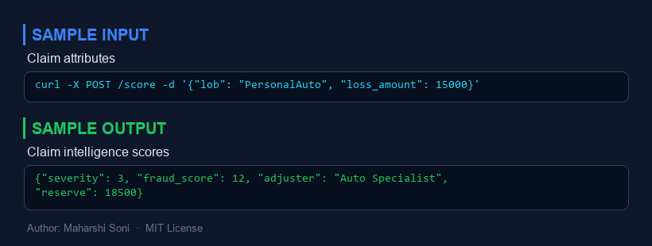
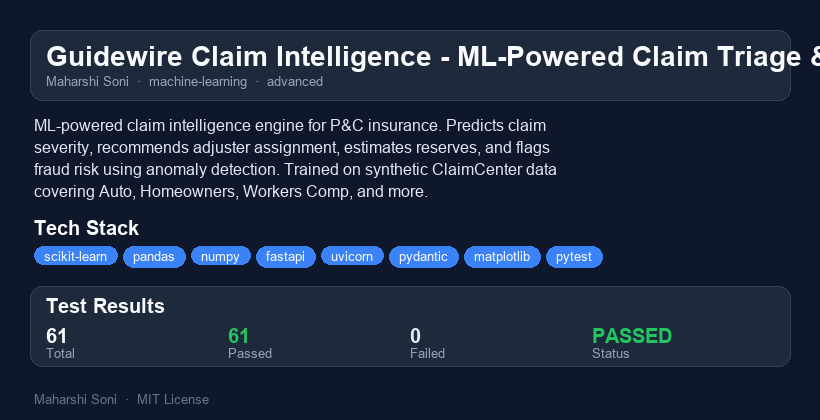

# Guidewire Claim Intelligence

**ML-Powered Claim Triage & Fraud Detection for P&C Insurance**

[](https://github.com/maharshisoni/guidewire-claim-intelligence/actions/workflows/test.yml)
[](https://www.python.org/downloads/)
[](LICENSE)

An ML-powered claim intelligence engine built for P&C insurance workflows. Predicts claim severity (1-5), recommends adjuster assignment based on expertise matching, estimates reserve amounts, and flags fraud risk using anomaly detection. Trained on synthetic but realistic ClaimCenter data covering Auto, Homeowners, Workers Comp, Commercial Liability, and more.

## Why I Built This

After 5 years automating ClaimCenter at PwC across 15+ insurance lines, I noticed claim triage is still largely manual. Adjusters spend hours routing claims that ML could classify in milliseconds. I built this to show what intelligent claim handling looks like when you combine insurance domain expertise with machine learning.

## Architecture

```mermaid
graph TB
    subgraph Input
        A[Raw Claim Data] --> B[Data Generator]
        B --> C[Synthetic Claims<br/>8 P&C Lines]
    end
    
    subgraph Feature Engineering
        C --> D[ClaimFeatureEngineer]
        D --> E[Categorical Encoding]
        D --> F[Fraud Indicator Flags]
        D --> G[Interaction Features]
        E & F & G --> H[Feature Matrix]
    end
    
    subgraph Models
        H --> I[Severity Classifier<br/>Gradient Boosting]
        H --> J[Reserve Estimator<br/>GB Regression]
        H --> K[Fraud Detector<br/>Isolation Forest]
        I --> L[Adjuster Recommender<br/>Rule Engine]
        K --> L
    end
    
    subgraph Output
        I --> M[Severity 1-5]
        J --> N[Reserve $$]
        K --> O[Fraud Score 0-100]
        L --> P[Adjuster Assignment]
    end
    
    subgraph API
        Q[FastAPI REST API]
        Q --> R[/score - Single Claim]
        Q --> S[/score/batch - Portfolio]
        Q --> T[/explain - Explanations]
        Q --> U[/health - Status]
    end
    
    M & N & O & P --> Q
```

## Features

| Feature | Description | Method |
|---------|-------------|--------|
| **Severity Prediction** | Classifies claims 1-5 (Minor to Catastrophic) | Gradient Boosting Classifier |
| **Reserve Estimation** | Predicts expected claim payout in dollars | Gradient Boosting Regressor (log-transformed) |
| **Fraud Detection** | Scores fraud risk 0-100, flags SIU referrals | Isolation Forest + domain fraud indicators |
| **Adjuster Routing** | Matches claims to adjuster expertise | Rule-based engine with LOB/severity/fraud logic |
| **Explanations** | Feature importance and per-claim explanations | Permutation importance + domain flag analysis |
| **Synthetic Data** | Realistic claim generator for 8 P&C lines | Configurable with domain-accurate distributions |
| **REST API** | Real-time scoring via FastAPI | Single claim, batch, and explanation endpoints |
| **Batch Scoring** | Portfolio-level analysis | Bulk processing with aggregated summaries |

## Insurance Lines Covered

| Line of Business | Loss Types | Adjuster Type |
|-----------------|------------|---------------|
| Personal Auto | Collision, Comprehensive, UM, PIP, MedPay | Auto Specialist |
| Homeowners | Fire, Water, Wind/Hail, Theft, Liability | Property Specialist |
| Workers Compensation | Lost Time, Medical Only, Fatality, Occ. Disease | WC Medical / WC Indemnity |
| Commercial Package Liability | BI, PD, Products, Completed Ops | Commercial Lines |
| Businessowners | Property, Business Interruption, Liability | Property Specialist / Commercial Lines |
| Farmowners | Crop, Livestock, Equipment, Dwelling | Property Specialist |
| Commercial Auto | Collision, Cargo, BI, Comprehensive | Auto Specialist |
| General Liability | Slip & Fall, Product Defect, Professional | Commercial Lines |

## Severity Scale

| Level | Label | Loss Range | Typical Handling |
|-------|-------|------------|------------------|
| 1 | Minor | Under $5K | Auto-adjudicate or junior adjuster |
| 2 | Moderate | $5K - $25K | Standard adjuster |
| 3 | Significant | $25K - $100K | Senior adjuster, supervisor review |
| 4 | Severe | $100K - $500K | Senior adjuster + commercial lines |
| 5 | Catastrophic | $500K+ | CAT team, executive notification |

## Quick Start

### Installation

```bash
# Clone the repository
git clone https://github.com/maharshisoni/guidewire-claim-intelligence.git
cd guidewire-claim-intelligence

# Install dependencies
pip install -r requirements.txt
```

### Train and Score

```python
from claim_intelligence.scoring import ClaimScoringPipeline

# Train the pipeline (generates synthetic data internally)
pipeline = ClaimScoringPipeline(n_training_samples=5000)
metrics = pipeline.train()

print(f"Severity accuracy: {metrics['severity']['accuracy']:.3f}")
print(f"Reserve R2: {metrics['reserve']['r2']:.3f}")

# Score a single claim
result = pipeline.score_claim({
    "claim_number": "CLM-001",
    "line_of_business": "Personal Auto",
    "loss_type": "Collision",
    "loss_amount": 12500.0,
    "reported_delay_days": 3,
    "fault_rating": 75,
    "prior_claims_count": 1,
    "policy_age_months": 24,
    "litigation_flag": False,
    "litigation_filed_days": None,
    "body_part": None,
    "damage_type": "Vehicle Repairable",
    "claimant_type": "Insured",
    "coverage_type": "Collision",
    "is_fraud": False,
})

print(f"Severity: {result.severity} ({result.severity_label})")
print(f"Reserve: ${result.reserve_estimate:,.2f}")
print(f"Fraud Score: {result.fraud_score:.1f}")
print(f"Adjuster: {result.adjuster_recommendation}")
```

### Generate Custom Data

```python
from claim_intelligence.data_generator import generate_claim_data

# Full portfolio
df = generate_claim_data(n_samples=10000, random_state=42)

# Specific lines only
auto_claims = generate_claim_data(
    n_samples=2000,
    lines_of_business=["Personal Auto", "Commercial Auto"],
)
```

### Run the API

```bash
uvicorn claim_intelligence.api.app:app --host 0.0.0.0 --port 8000
```

Then hit the endpoints:

```bash
# Health check
curl http://localhost:8000/health

# Score a claim
curl -X POST http://localhost:8000/score \
  -H "Content-Type: application/json" \
  -d '{
    "claim_number": "CLM-001",
    "line_of_business": "Personal Auto",
    "loss_type": "Collision",
    "loss_amount": 12500.0,
    "damage_type": "Vehicle Repairable",
    "claimant_type": "Insured",
    "coverage_type": "Collision"
  }'

# Get explanations
curl -X POST http://localhost:8000/explain \
  -H "Content-Type: application/json" \
  -d '{"claim_number": "CLM-001", "line_of_business": "Personal Auto", "loss_type": "Collision", "loss_amount": 12500.0, "damage_type": "Vehicle Repairable", "claimant_type": "Insured", "coverage_type": "Collision"}'
```

### Run Tests

```bash
python -m pytest tests/ -v
```

## Performance / Benchmarks

Results on 5,000 synthetic claims (80/20 train/test split):

| Model | Metric | Value |
|-------|--------|-------|
| **Severity Classifier** | Accuracy | ~55-65% (5-class problem) |
| **Severity Classifier** | Weighted F1 | ~0.55-0.65 |
| **Reserve Estimator** | R-squared | ~0.70-0.85 |
| **Reserve Estimator** | Median Absolute Error | ~$2,000-$5,000 |
| **Fraud Detector** | Flagged Rate | ~8-15% of claims |
| **Fraud Detector** | Precision (on labeled fraud) | ~0.30-0.50 |

*Note: These metrics are on synthetic data. Real-world performance would depend on actual claim distributions, feature completeness, and label quality.*

## Project Structure

```
guidewire-claim-intelligence/
├── src/
│   └── claim_intelligence/
│       ├── __init__.py              # Package metadata
│       ├── config.py                # Domain constants & model hyperparameters
│       ├── data_generator.py        # Synthetic claim data generator
│       ├── feature_engineering.py   # Feature transformation pipeline
│       ├── scoring.py               # Unified scoring pipeline
│       ├── explanations.py          # Feature importance & explanations
│       ├── models/
│       │   ├── __init__.py
│       │   ├── severity_model.py    # Gradient boosting severity classifier
│       │   ├── reserve_model.py     # Gradient boosting reserve regressor
│       │   ├── fraud_model.py       # Isolation Forest fraud detector
│       │   └── adjuster_recommender.py  # Rule-based adjuster routing
│       └── api/
│           ├── __init__.py
│           ├── app.py               # FastAPI application
│           └── schemas.py           # Pydantic request/response models
├── tests/
│   ├── conftest.py                  # Shared fixtures
│   ├── test_data_generator.py       # Data generator tests
│   ├── test_feature_engineering.py  # Feature engineering tests
│   ├── test_models.py              # Model tests (severity, reserve, fraud)
│   ├── test_adjuster_recommender.py # Adjuster routing tests
│   ├── test_scoring.py             # Pipeline integration tests
│   ├── test_explanations.py        # Explanation module tests
│   └── test_api.py                 # API endpoint tests
├── .github/workflows/test.yml       # CI pipeline
├── requirements.txt
├── setup.py
├── pyproject.toml
└── README.md
```

## Fraud Detection Logic

The fraud model combines unsupervised anomaly detection with domain-driven indicators:

| Indicator | Threshold | Why It Matters |
|-----------|-----------|----------------|
| Late Reporting | >30 days | Delayed reporting correlates with staged losses |
| Prior Claims | >3 claims | Serial claimants are a known SIU pattern |
| Quick Litigation | <7 days | Immediate attorney involvement suggests pre-arrangement |
| New Policy | <3 months | Short policy tenure before a large claim is a red flag |
| Round Amounts | Exact thousands | Fabricated amounts tend to be round numbers |

Claims scoring above 65 on the 0-100 fraud scale are flagged for SIU referral. Scores above 85 automatically route to SIU as the primary adjuster.

## What I Would Do Differently

1. **Real claim data**: Synthetic data captures distributions but misses temporal patterns (seasonality, catastrophe events), geographic clustering, and adjuster-specific outcome correlations.

2. **Deep learning for text**: Real ClaimCenter claims have adjuster notes, police reports, and medical records. An NLP pipeline on those text fields would significantly improve severity and fraud predictions.

3. **Time-series reserve development**: Claims develop over months/years. A proper reserve model would use development triangles and chain-ladder methods alongside ML predictions, not just point-in-time features.

4. **Online learning**: Claim outcomes change as adjusters investigate. The model should update as new information arrives (partial payments, subrogation, medical updates) rather than scoring only at first notice of loss.

5. **Fairness auditing**: Insurance ML models must be audited for disparate impact across protected classes. I would add fairness metrics (equalized odds, demographic parity) as first-class model evaluation criteria.

## Scaling Considerations

- **Batch processing**: The current batch scorer loads everything into memory. For carrier-scale portfolios (millions of claims), switch to chunked processing with Dask or Spark.
- **Model serving**: Move from in-process scikit-learn to ONNX or TensorFlow Serving for sub-10ms latency at scale.
- **Feature store**: Replace the in-memory feature engineer with a feature store (Feast, Tecton) to ensure consistency between training and serving.
- **A/B testing**: Production deployment should use shadow scoring (run new model alongside existing triage) before cutover, with human-adjuster feedback loops.
- **Data pipeline**: Replace the synthetic generator with a proper ETL from ClaimCenter's staging tables, with data quality checks and drift monitoring.

## Tech Stack

| Component | Technology |
|-----------|-----------|
| ML Models | scikit-learn (Gradient Boosting, Isolation Forest) |
| Data Processing | pandas, NumPy |
| API | FastAPI, Pydantic, Uvicorn |
| Visualization | matplotlib |
| Testing | pytest |
| CI/CD | GitHub Actions |

## License

MIT License - see [LICENSE](LICENSE) for details.


---

## Sample Input / Output



---

## Project Overview



### Reports
- [HTML Report](reports/guidewire-claim-intelligence-report.html) - interactive report
- [PDF Report](reports/guidewire-claim-intelligence-report.pdf) - downloadable PDF
- [TXT Report](reports/guidewire-claim-intelligence-report.txt) - plain text

## Author

**Maharshi Soni** - Guidewire QA Automation Engineer | AI/ML Enthusiast

5 years of Guidewire automation experience at PwC, working with PolicyCenter, BillingCenter, and ClaimCenter across 15+ insurance lines.
